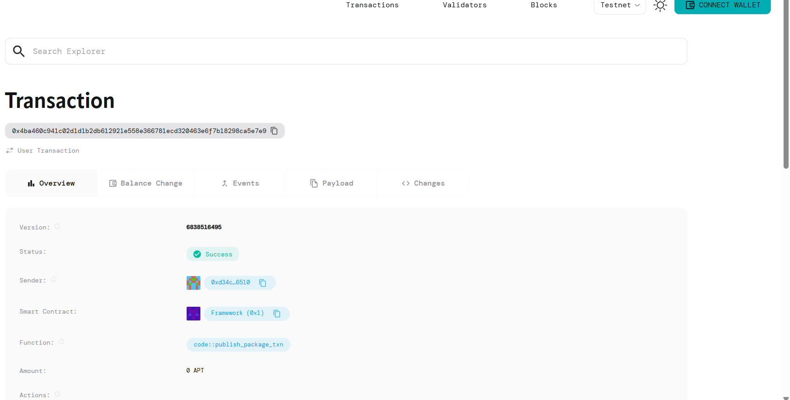

# MemeContestV2 Smart Contract

## Project Description

MemeContestV2 is a decentralized meme competition platform built on the Aptos blockchain that enables community-driven meme contests with built-in voting mechanisms and prize distribution. The smart contract facilitates fair and transparent meme competitions where participants can submit their memes by paying a small fee, vote for their favorite submissions, and compete for prizes from a dynamically growing prize pool.

The platform operates on a simple yet effective model: participants pay a submission fee to enter their memes into the contest, which simultaneously adds to the total prize pool and grants them voting rights for existing submissions. This creates an engaging ecosystem where the community directly contributes to and benefits from the contest's success.

## Project Vision

Our vision is to revolutionize digital content creation and community engagement by providing a decentralized, transparent, and fair platform for meme competitions. We aim to:

- **Democratize Content Creation**: Provide equal opportunities for creators of all backgrounds to showcase their creativity and earn rewards
- **Foster Community Engagement**: Build vibrant communities around shared humor and creativity through interactive voting mechanisms
- **Ensure Transparency**: Leverage blockchain technology to guarantee fair voting, transparent prize distribution, and tamper-proof contest results
- **Create Economic Opportunities**: Enable content creators to monetize their creativity while building sustainable creator economies
- **Bridge Web2 and Web3**: Make blockchain technology accessible to mainstream internet culture through familiar and entertaining meme contests

## Key Features

### 🎯 **Contest Creation & Management**
- Contest organizers can easily create new meme contests with customizable parameters
- Flexible submission fee structure to accommodate different contest scales
- Initial prize pool setup with automatic expansion through participant fees

### 💰 **Dynamic Prize Pool System**
- Prize pool automatically grows with each new submission
- Transparent fund management with all transactions recorded on-chain
- Secure prize distribution mechanisms

### 🗳️ **Integrated Voting Mechanism**
- Participants gain voting rights upon meme submission
- One vote per submission to maintain fairness
- Real-time vote tracking and transparent results

### 🔐 **Secure Payment Processing**
- Built-in AptosCoin integration for seamless transactions
- Automatic fee collection and prize pool management
- Secure fund handling with blockchain-guaranteed execution

### 📊 **Transparent Operations**
- All contest data stored on-chain for complete transparency
- Public visibility of submissions, votes, and prize pools
- Immutable contest history and results

### ⚡ **User-Friendly Participation**
- Simple one-transaction submission and voting process
- Low barrier to entry with minimal technical requirements
- Instant confirmation of submissions and votes

## Future Scope

### 🚀 **Platform Enhancements**
- **Multi-Token Support**: Expand beyond AptosCoin to support various cryptocurrencies and tokens
- **NFT Integration**: Allow memes to be automatically minted as NFTs upon submission
- **Advanced Voting Systems**: Implement weighted voting, quadratic voting, and anti-manipulation mechanisms
- **Contest Categories**: Support for themed contests, seasonal competitions, and specialized meme formats

### 🎨 **Creator Tools & Features**
- **Meme Creation Tools**: Integrated meme generator and editing capabilities
- **Creator Profiles**: Comprehensive creator profiles with portfolio tracking and achievement systems
- **Collaboration Features**: Team-based meme creation and split prize mechanisms
- **Analytics Dashboard**: Detailed performance metrics for creators and contest organizers

### 🌐 **Community & Social Features**
- **Social Integration**: Connect with popular social media platforms for wider reach
- **Community Governance**: DAO-based governance for platform decisions and feature development
- **Reputation Systems**: Creator and voter reputation tracking to ensure quality participation
- **Live Streaming**: Real-time contest events and community interactions

### 🔧 **Technical Improvements**
- **Cross-Chain Compatibility**: Expand to multiple blockchain networks for broader accessibility
- **Mobile Application**: Dedicated mobile apps for iOS and Android platforms
- **API Development**: Public APIs for third-party integrations and ecosystem development
- **Scalability Solutions**: Implement layer-2 solutions for reduced transaction costs and faster processing

### 💼 **Business & Partnership Opportunities**
- **Brand Partnerships**: Corporate-sponsored contests and branded competitions
- **Educational Initiatives**: Partnerships with educational institutions for creative learning programs
- **Content Licensing**: Marketplace for licensing winning memes for commercial use
- **Creator Economy**: Advanced monetization tools including subscriptions, tips, and merchandise integration

## Contract Details

"0x4ba460c941c02d1d1b2db612921e558e366781ecd320463e6f7b18298ca5e7e9"

